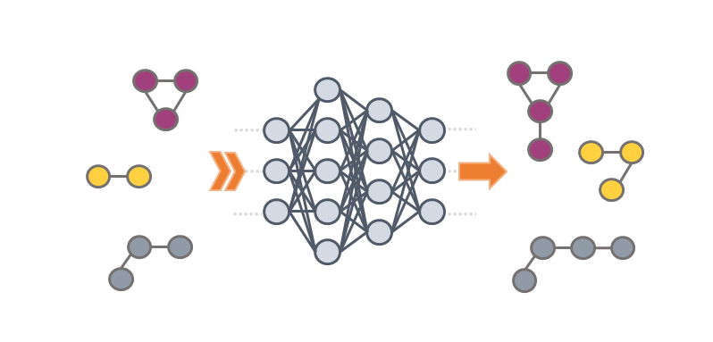

# GraphINVENT2



GraphINVENT2 is a platform for graph-based molecular generation and optimization.
It uses a tiered deep neural network architecture (GGNN) to probabilistically
generate new molecules one bond at a time, and reinforcement learning to guide
the model towards molecules with user-defined properties.

This is the actively maintained successor to GraphINVENT.  The methods are
described in [*Graph Networks for Molecular Design*](https://iopscience.iop.org/article/10.1088/2632-2153/abcf91)
(Mercado et al., 2021).

---

## Table of contents

1. [Features](#features)
2. [Installation](#installation)
3. [Quick start](#quick-start)
4. [Job types](#job-types)
5. [Tutorials](#tutorials)
6. [Testing](#testing)
7. [Contributing](#contributing)
8. [Changes from GraphINVENT](#changes-from-graphinvent)
9. [References](#references)
10. [License](#license)

---

## Features

- **Autoregressive graph generation** — builds molecules atom-by-atom using a gated graph neural network (GGNN).
- **Pretraining** — learn a prior distribution over a large molecular dataset.
- **Transfer learning** — adapt a pretrained model to a new chemical space with a smaller, focused dataset.
- **Reinforcement learning** — optimize toward user-defined scoring criteria (QED, QSAR activity, target size, or custom).
- **Flexible preprocessing** — auto-detects molecular feature vocabulary; supports random, Butina-cluster, or custom dataset splits.
- **GPU and CPU support** — runs on CUDA GPUs or CPU; SLURM submission included.

---

## Installation

**Requirements:** Python 3.9+, pip.

### 1. Clone the repository

```bash
git clone https://github.com/ailab-bio/GraphINVENT2.git
cd GraphINVENT2
```

### 2. Create a virtual environment

```bash
python -m venv .venv
source .venv/bin/activate        # Linux / macOS
# .venv\Scripts\activate         # Windows (PowerShell)
```

### 3. Install PyTorch

Visit [pytorch.org/get-started/locally](https://pytorch.org/get-started/locally/) to
get the exact command for your platform and CUDA version.  Common cases:

```bash
# CPU only (any platform)
pip install torch torchvision torchaudio --index-url https://download.pytorch.org/whl/cpu

# NVIDIA GPU — replace cu121 with your CUDA version (e.g. cu118, cu124)
pip install torch torchvision torchaudio --index-url https://download.pytorch.org/whl/cu121

# Apple Silicon (M1/M2/M3) — standard pip install uses MPS automatically
pip install torch torchvision torchaudio
```

### 4. Install GraphINVENT2

Install the package and all remaining dependencies in one command:

```bash
pip install -e .
```

This installs GraphINVENT2 in **editable mode** — changes to the source files in
`graphinvent/` take effect immediately without reinstalling.  It also registers
the `graphinvent-submit` command (equivalent to `python submit.py`).

### Verify

```bash
python -c "import torch, rdkit, h5py; print('Setup complete. PyTorch', torch.__version__)"
```

### Optional extras

```bash
pip install -e ".[tdc]"   # adds PyTDC for tools/tdc-create-dataset.py
pip install -e ".[dev]"   # adds ruff + pyright for development
```

### Conda alternative

If you prefer Conda (e.g. on Windows where RDKit pip wheels are sometimes unavailable):

```bash
conda create -n graphinvent python=3.11 -y
conda activate graphinvent
conda install -c pytorch -c nvidia pytorch torchvision torchaudio pytorch-cuda=12.1 -y
conda install -c conda-forge rdkit h5py tqdm scikit-learn matplotlib tensorboard -y
```

### HPC / Singularity

A Singularity definition file is available at `docker/graphinvent.def` for
cluster environments where Conda or pip virtualenvs are not practical.

---

## Quick start

### 1. Preprocess a dataset

> **Tip:** The `jobs/*/params.json` files are templates — copy them before
> editing so the originals stay pristine and you can track settings per
> experiment:
> ```bash
> cp jobs/preprocess/params.json jobs/preprocess/my_experiment.json
> ```
> Then pass your copy to `submit.py --config`.

Edit a copy of `jobs/preprocess/params.json` to point at your SMILES file, then run:

```bash
python submit.py --config jobs/preprocess/params.json
# or, after pip install -e .:
graphinvent-submit --config jobs/preprocess/params.json
```

Feature parameters (`atom_types`, `formal_charge`, `imp_H`, `max_n_nodes`) are
**auto-detected** from the SMILES data — you only need to set encoding flags
(`use_chirality`, `use_aromatic_bonds`, etc.).

A small preprocessed example dataset is at `data/gdb13_1K/` if you want to
skip preprocessing and go straight to training.

### 2. Train a model

```bash
python submit.py --config jobs/unconditional/params.json
```

Training progress is logged to `output/<dataset>/unconditional/run/convergence.log`.
If `use_tensorboard: true`, launch the dashboard with:

```bash
tensorboard --logdir output/<dataset>/pretrain/<job_name>/tensorboard/
```

### 3. Generate molecules

```bash
python submit.py --config jobs/generate/params.json
```

Generated SMILES are written to `output/<dataset>/generate/<job_name>/` as `<n_samples>_samples.smi`.

### Visualizing generated molecules

Use the root-level `visualize.py` script to render any `.smi` file as a PNG grid image:

```bash
python visualize.py path/to/molecules.smi                      # 25 random molecules, 5 columns
python visualize.py path/to/molecules.smi --n 50 --ncols 10   # 50 random molecules, 10 columns
python visualize.py path/to/molecules.smi --first              # first N instead of random
python visualize.py path/to/molecules.smi --size 300x200 --out grid.png  # custom cell size / output path
```

The output PNG is saved next to the input file as `<filename>_grid.png` by default.

---

## Job types

All jobs are launched with:

```bash
python submit.py --config jobs/<job_type>/params.json
```

Each config has two sections: `"submission"` (how to run) and `"job"` (what to
run).  Output is always written to `output/<dataset>/<job_type>/job_<idx>/`.

| Job type | Config | Description |
|----------|--------|-------------|
| `preprocess` | `jobs/preprocess/params.json` | Convert SMILES to HDF5; auto-detects feature vocabulary |
| `unconditional` | `jobs/unconditional/params.json` | Train from scratch or fine-tune (set `resume_from`) an unconditional model |
| `conditional` | `jobs/conditional/params.json` | Train a property-conditioned model (requires TSV input with property columns) |
| `goal_directed` | `jobs/goal_directed/params.json` | RL optimization toward scoring criteria; set `oracle_budget` to cap calls |
| `generate` | `jobs/generate/params.json` | Sample new molecules from a trained model |

### Typical workflows

```
Preprocess → Unconditional → Generate
Preprocess (new data) → Unconditional (resume_from=checkpoint) → Generate   # transfer learning
Unconditional → Goal-directed → Generate
Preprocess (TSV with properties) → Conditional → Generate (with sample_conditions)
```

---

## Tutorials

| Tutorial | Topic |
|----------|-------|
| [01 Preprocessing](./tutorials/01_preprocessing.md) | Convert SMILES to HDF5 |
| [02 Pretraining](./tutorials/02_pretraining.md) | Train from scratch (unconditional) |
| [03 Transfer learning](./tutorials/03_transfer_learning.md) | Fine-tune on a new dataset (unconditional + resume_from) |
| [04 Reinforcement learning](./tutorials/04_reinforcement_learning.md) | Goal-directed property optimization |
| [05 Sampling](./tutorials/05_sampling.md) | Generate molecules |
| [05 Conditional generation](./tutorials/05_conditional_generation.md) | Train and sample a property-conditioned model |

---

## Testing

The test suite verifies that a completed preprocessing job produced correct output.
All commands should be run from the **repository root**.

### 1. Configure the target dataset

Edit `tests/config.py` to point at the dataset you want to verify:

```python
# tests/config.py
DATASET_DIR = Path("data/datasets/debug")   # must contain .smi and .h5 files
SMILES_FILE = Path("data/datasets/debug/debug.smi")  # original input; set to None for Mode B
```

### 2. Run the tests

```bash
pytest tests/ -v
```

### What is tested

| Test class | Checks |
|------------|--------|
| `TestSplitFileCounts` | `train/valid/test.smi` exist; molecule counts sum to the original file; no overlap between splits |
| `TestHDFFileCounts` | `train/valid/test.h5` exist and contain `nodes`, `edges`, `action probabilities`; HDF5 molecule count matches `.smi` count; subgraph count ≥ molecule count |
| `TestSMILESReconstruction` | Every graph in each HDF5 decodes to a valid SMILES; reconstructed SMILES set matches the `.smi` file (lossless round-trip) |

---

## Contributing

Contributions are welcome as issues or pull requests.  To report a bug, please
open an issue on GitHub.

---

## Changes from GraphINVENT

GraphINVENT2 is a significant rewrite of the original GraphINVENT codebase.
**Existing workflows, config files, and preprocessed datasets are not compatible
and must be recreated.**  The changes below are organized by whether they break
existing usage or add new capability.

### Breaking changes

#### Job configuration (`submit.py`)
The original `submit.py` was a Python script with a hardcoded `Config` class that
you edited directly.  It has been replaced by a JSON-driven CLI:

```bash
# old
python submit.py           # edit Config class inside the file before running

# new
python submit.py --config jobs/unconditional/params.json
```

Each config file has two top-level keys:
- `"submission"` — how/where to run (Python path, SLURM settings, dataset name)
- `"job"` — what to run (`job_type` + all model/training hyperparameters)

Template configs live in `jobs/*/params.json`.

#### `job_type` values renamed

| Old value (GraphINVENT) | New value (GraphINVENT2) | Notes |
|-------------------------|--------------------------|-------|
| `"train"` | `"unconditional"` | Train from scratch or fine-tune (set `resume_from`) |
| `"fine-tune"` | `"unconditional"` + `resume_from` | Supervised fine-tuning on a new dataset |
| *(none)* | `"goal_directed"` | RL optimization; set `oracle_budget` to cap oracle calls |
| *(none)* | `"conditional"` | Property-conditioned generation (new in GraphINVENT2) |
| *(none)* | `"generate"` | Generation/evaluation; set `sample_mode` to `"generate"` or `"evaluate"` |

Deprecated aliases still work (with a warning): `pretrain`, `transfer`, `rl`, `constrained_rl`, `sample`, `test`.

#### HDF5 dataset key renamed: `"APDs"` → `"action_probs"`
All HDF5 files produced by the old preprocessor used the internal key `"APDs"`.
The new loader expects `"action_probs"`.  **All previously preprocessed `.h5`
files must be regenerated** with the new code before training.

#### Preprocessing parameter file: `.csv` → `.json`
The old code wrote `preprocessing_params.csv`; the new code writes
`preprocessing_params.json`.  Old `.csv` files are not read by the new code.

#### Specifying a pretrained model checkpoint
The old `generation_epoch` integer + `pretrained_model_dir` directory pattern
has been replaced by a single direct path:

```json
// old (generate job)
{ "generation_epoch": 100, "pretrained_model_dir": "output/debug/pretrain/run/" }

// new (generate, transfer, and rl jobs)
{ "pretrained_model_path": "output/debug/pretrain/run/model_restart_100.pth" }
```

Model architecture and dataset parameters are loaded automatically from the
`params_all.json` file in the same directory as the `.pth` checkpoint.

#### Data directory layout

| Old path | New path |
|----------|----------|
| `data/pre-training/<dataset>/` | `data/datasets/<dataset>/` |
| `data/fine-tuning/<dataset>/` | `data/datasets/<dataset>/` |

#### Output directory layout
TensorBoard logs are now written **inside** the job directory instead of a
sibling `tensorboard/` folder, making each run self-contained:

| Old | New |
|-----|-----|
| `output/<dataset>/<job_type>/tensorboard/<job_name>/` | `output/<dataset>/<job_type>/<job_name>/tensorboard/` |

#### Generation output files
Old code kept per-batch files (`epoch_GEN<N>_batch_<B>.smi`) permanently.
New code concatenates all batches into a single trio of files at the job root
and removes the temporary `generation/` directory:

```
# old
output/<dataset>/generate/<job_name>/generation/epoch_GEN100_batch_0.smi
output/<dataset>/generate/<job_name>/generation/epoch_GEN100_batch_1.smi
...

# new
output/<dataset>/generate/<job_name>/<n_samples>_samples.smi
output/<dataset>/generate/<job_name>/<n_samples>_samples.likelihood
output/<dataset>/generate/<job_name>/<n_samples>_samples.valid
```

#### Internal renames (relevant if you import GraphINVENT2 modules directly)

| Old name | New name |
|----------|----------|
| `DataProcesser` (class + file) | `DataProcessor` |
| `APDReadout` | `ActionProbReadout` |
| `get_decoding_APD()` | `get_action_probs()` |
| `get_final_decoding_APD()` | `get_final_action_probs()` |
| HDF5 key `"APDs"` | `"action_probs"` |

#### Python version requirement
Python 3.6/3.8 (old) → **Python 3.9+** (new).

---

### New features

| Feature | Description |
|---------|-------------|
| **Auto feature detection** | `atom_types`, `formal_charge`, `imp_H`, `max_n_nodes` are scanned automatically from the SMILES file; no manual specification needed. |
| **Built-in dataset splitting** | Pass a single SMILES file via `smiles_file`; the code splits it into train/valid/test using random, Butina-cluster, or custom strategies. |
| **Apple Silicon (MPS) support** | Device selection now works on Apple M-series GPUs in addition to CUDA and CPU. |
| **Reproducibility logging** | `params_all.json` records the random seed, Python/PyTorch/RDKit/NumPy versions, CUDA version, device name, and git commit hash for every run. |
| **Random seed control** | Set `"seed": <int>` (0 = non-deterministic) to fix all RNG sources across Python, NumPy, and PyTorch. |
| **Backup on re-run** | Re-running a job into an existing output directory automatically backs up previous results to `_previous_run_<timestamp>/` instead of overwriting. |
| **`visualize.py`** | Root-level script to render any `.smi` file as a molecule grid PNG (see [Visualizing generated molecules](#visualizing-generated-molecules)). |
| **`cleanup.py`** | Root-level script to remove stale outputs, preprocessed data, and backup directories with an interactive confirmation step. |
| **Unit tests** | `tests/` verifies split correctness, HDF5 structure, and SMILES round-trip fidelity after preprocessing. |
| **Tutorials** | Five end-to-end tutorials in `tutorials/` covering preprocessing through RL. |

---

## References

If you use GraphINVENT2 in your research, please cite:

```bibtex
@article{mercado2020graph,
  author  = {Roc{\'{i}}o Mercado and Tobias Rastemo and Edvard Lindel{\"{o}}f
             and G{\"{u}}nter Klambauer and Ola Engkvist and Hongming Chen
             and Esben Jannik Bjerrum},
  title   = {Graph Networks for Molecular Design},
  journal = {Machine Learning: Science and Technology},
  year    = {2021},
  doi     = {10.1088/2632-2153/abcf91}
}

@article{mercado2020practical,
  author  = {Roc{\'{i}}o Mercado and Tobias Rastemo and Edvard Lindel{\"{o}}f
             and G{\"{u}}nter Klambauer and Ola Engkvist and Hongming Chen
             and Esben Jannik Bjerrum},
  title   = {Practical Notes on Building Molecular Graph Generative Models},
  journal = {Applied AI Letters},
  year    = {2021},
  doi     = {10.1002/ail2.18}
}
```

---

## License

GraphINVENT2 is licensed under the MIT license and is provided as-is.

GitHub: https://github.com/ailab-bio/GraphINVENT2
